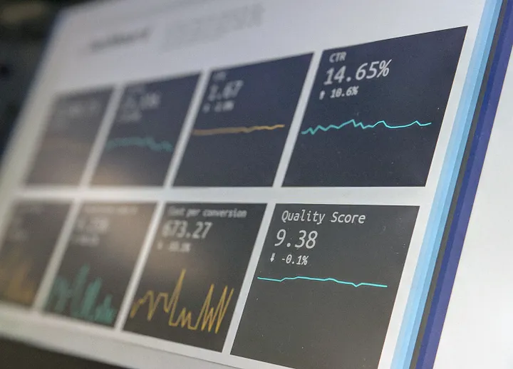

Originalmente publicado [aqui](https://medium.com/luizalabs/o-que-aprendi-como-cientista-de-dados-no-magalu-6687b8d1aded)

> DISCLAIMER: Este é um artigo de opinião e não, necessariamente, reflete a posição oficial do Magazine Luiza acerca dos assuntos comentados no texto.

*Photo by Stephen Dawson on Unsplash*

Como cientista de dados trabalhando no time de recomendações do Magazine Luiza por cerca de 2 anos e meio, tenho passado por muitos sucessos e fracassos ao longo desta incrível jornada. Neste artigo, pretendo compartilhar algumas coisas que aprendi durante o caminho.

Vejo muitos artigos sobre ciência de dados focados em técnicas para manipulação de dados, feature engineering, modelos de regressão, classificação e outros milhares de assuntos super relevantes. Porém, há um aspecto que considero muito mais importante para um cientista de dados em qualquer que seja o seu ramo de atuação: soft skills.

# Comunicação é rainha

*Comunicação é rainha, assim como a Elizabeth II.*

Dentro de um time, o cientista de dados é o profissional que possui maior bagagem técnica quando se trata de dados. Ele sabe como explorar os dados a fim de entender e descrever o problema, formular hipóteses, planejar experimentos, sabe identificar pontos fora da curva, extrair correlações, criar modelos preditivos, criar gráficos interativos e tudo mais.

Além disso, em geral, ele conhece muito sobre o domínio em que atua, sabe muito bem quais são os problemas, soluções, desafios e oportunidades da área. É difícil pegar um cientista de dados de surpresa em seu domínio, ele é um sabichão nato.

> *In God we trust, all others bring data.*
> 
> — William Edwards Deming

Nada disso tem valor se o cientista de dados guarda todo esse arcabouço de conhecimento para si. É preciso expor suas ideias para seus colegas e ajudá-los a enxergar o que apenas você está enxergando. No processo, você vai ter que ter a paciência e resiliência que um professor teria e, acredite ou não, muitas vezes você estará errado.

Se você falhar em se comunicar com as pessoas que trabalham com você, o melhor que conseguirá é ser a pessoa com a melhor ideia na sala, com dezenas de artigos suportando sua hipótese, mas ainda sim, ela não será a ideia implementada pelo time. Seu time falhou. Você falhou.

*Fonte: [Wikipedia](https://en.wikipedia.org/wiki/Enron:_The_Smartest_Guys_in_the_Room)*

# Melhoria contínua

Se você seguir o primeiro conselho sobre comunicação, vai compartilhar seus pontos de vista com seus colegas, escutar os deles, discutir e chegar a um acordo sobre o problema. Eventualmente, vocês não concordarão sobre um ponto, mas tudo bem, [disagree and commit](https://en.wikipedia.org/wiki/Disagree_and_commit).

No entanto, nem sempre a sua atitude de compartilhar suas incríveis ideias copiadas do Arxiv ou do Facebook AI serão adotadas pelo seu time. Isso acontecerá pelos mais variados motivos: falta de recursos, prioridade baixa sob a perspectiva de negócio ou, ainda, a ideia é simplesmente ruim. Qualquer que seja o caso, não desista e você será recompensado.

Isso serve para outros aspectos do trabalho com um time também. Se algo está te incomodando no processo de desenvolvimento, no ambiente, na forma como vocês fazem deploy ou qualquer outra coisa, fale. Ninguém tem bola de cristal.

*Photo by [Andrés Gómez](https://unsplash.com/pt-br/@andresloquesea) on [Unsplash](https://unsplash.com/pt-br)*

# Blinde-se da hype

A *hype*. Como eu adoro a *hype*. Para quem não sabe, *hype* é o termo usado para designar algo que está na moda. Em ciência de dados, por exemplo, está na moda resolver problemas usando *deep learning* (reconheço, obviamente, os incríveis avanços proporcionados por essa subárea de conhecimento).

O problema da *hype* não é a *hype* em si. Se a coisa está na moda, deve ter algum valor e devemos dedicar atenção a ela. A armadilha é achar que encontramos a bala de prata. Aquela que solucionará todos os problemas de ciência de dados que você encontrará pela frente.

Nesse exemplo específico, a hype pode criar um sentimento de que se você não usa *deep learning* para resolver o problema de negócio, você não deveria se intitular cientista de dados. Aí você vai lá, faz a sua empresa gastar muitos recursos no desenvolvimento da coisa e, simplesmente, não resolve o problema.

> *Simple is better than complex.
Complex is better than complicated.*
>
> — Zen of Python

Francamente, nem todo mundo é Google, Facebook e Microsoft. Você não precisa começar resolvendo um problema com o estado da arte. Você precisa começar resolvendo o problema.

Então, aqui o primeiro conselho é: defina uma métrica de sucesso para o seu problema, apaixone-se por ele, comece pela solução mais simples e vá construindo, degrau a degrau, a solução ótima.

> Uma heurística que resolve o problema de negócio é melhor que uma rede neural que não sai da sua máquina local.

O segundo conselho é sempre pensar no [MVP](https://en.wikipedia.org/wiki/Minimum_viable_product). Além de começar com a solução mais simples, evite fazer coisas que você vai jogar fora depois! Construa blocos independentes, mas complementares. Construa o primeiro bloco já vislumbrando como se encaixará o centésimo.

Trabalhar em uma empresa é o verdadeiro *hackathon*, é construir todo dia, durante meses e anos, tijolinho por tijolinho, função por função, feature por feature.

# Colabore com o seu time para atingir os objetivos

A última lição, mas não a menos importante. Não adianta você atingir seus objetivos individuais como implementar um modelo maravilhoso, fazer uma grande análise ou qualquer outra coisa divertida se o seu time não está atingindo seus objetivos.

Então antes de evoluir aquele modelo, será que alguém do seu time não precisa de ajuda com a tarefa que está atuando? Você quase sempre pode fazer algo para ajudar mesmo que você não seja especialista naquele assunto. Às vezes, basta ser o [pato de borracha](https://en.wikipedia.org/wiki/Rubber_duck_debugging) do seu colega.

*Photo by [Andrew Wulf](https://unsplash.com/pt-br/@andreuuuw) on [Unsplash](https://unsplash.com/pt-br)*

No final do dia, mesmo que exista uma cobrança latente por tarefas concluídas, o que mais importa é o valor que o seu time entregou e o quanto disso impacta a vida das pessoas positivamente.

---

Essas foram as coisas mais importantes que eu aprendi durante essa jornada de quase 3 anos de Magazine Luiza. Obviamente, aprender não quer dizer que eu seja perfeito em todas elas, mas quer dizer que todo dia eu tento melhorar em cada uma delas. Obrigado a todos no Magalu que me ajudaram a aprender essas lições e espero continuar aprendendo muitas outras.

Embora eu tenha aprendido essas lições exercendo a função de cientista de dados, creio que elas podem generalizar para outros papéis e até outros setores que não a tecnologia. Então espero que seja útil para você independente da sua área.

